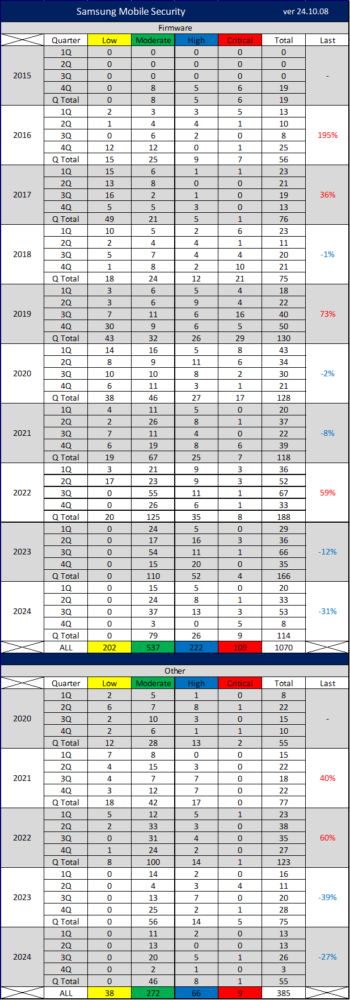

# Awesome Android Security    

# Theory
* [Android Kernel Exploitation](https://cloudfuzz.github.io/android-kernel-exploitation/)
* [Hacking Android Apps with Frida](https://www.youtube.com/watch?v=iMNs8YAy6pk)
* [Android Frida Scripts](https://github.com/androidmalware/android_frida_scripts)
* [Real-time Kernel Protection (RKP)](https://www.samsungknox.com/ko/blog/real-time-kernel-protection-rkp)
* [Android Developer Fundamentals](https://developer.android.com/courses/fundamentals-training/overview-v2)
* [Android Security Lecture](https://jyheo.github.io/androidsec/androidsec.html) : Professor 허준영 lecture material
* [Android Pentesting Checklist](https://mobexler.com/checklist.htm#android)
* [OWASP Mobile Security Testing Guide (MSTG)](https://github.com/OWASP/owasp-mstg)
* [OWASP Mobile Application Security Verification Standard (MASVS)](https://github.com/OWASP/owasp-masvs)
* [Frida Cheatsheet and Code Snippets for Android](https://erev0s.com/blog/frida-code-snippets-for-android/)
* [Frida HandBook](https://learnfrida.info/)
* [Android App Security Checklist](https://github.com/hamm0nz/android_app_security_checklist)
* [Android Vulnerabilities](https://oversecured.com/vulnerabilities) : Oversecured's Android Vulnerability List
* [Interception of Android implicit intents](https://blog.oversecured.com/Interception-of-Android-implicit-intents/)
* [Common mistakes when using permissions in Android](https://blog.oversecured.com/Common-mistakes-when-using-permissions-in-Android/)

# Report

#### 2018
* [Report] [Writing the worlds worst Android fuzzer](https://gamozolabs.github.io/fuzzing/2018/10/18/terrible_android_fuzzer.html)

#### 2019
* ~~[Report] [Samsung Galaxy Apps Store RCE via MITM](https://www.adyta.pt/en/writeup-samsung-app-store-rce-via-mitm-2/)~~ Unable to connect
* [Report] [Reverse-engineering Samsung S10 TEEGRIS TrustZone OS](http://allsoftwaresucks.blogspot.com/2019/05/reverse-engineering-samsung-exynos-9820.html)

#### 2020
* [Report] [Flaws in ‘Find My Mobile’ exposed Samsung phones to hack](https://char49.com/tech-reports/fmmx1-report.pdf)
* [Report] [Project Zero : MMS Exploit](https://googleprojectzero.blogspot.com/2020/07/mms-exploit-part-1-introduction-to-qmage.html)
* [Report] [Breaking Samsung firmware, or turning your S8/S9/S10 into a DIY “Proxmark”](https://www.pentestpartners.com/security-blog/breaking-samsung-firmware-or-turning-your-s8-s9-s10-into-a-diy-proxmark/?fbclid=IwAR0f8lwJmVtXzHU3T7n1zs8CG2QJlSf_3v8ffp03w-rwgb48_QxoUz7D09Q)
	* [Speaker] [Beyond Root](https://www.youtube.com/watch?v=aLe-xW-Ws4c)
* [Report] [Arbitrary code execution on Facebook for Android through download feature](https://dphoeniixx.medium.com/arbitrary-code-execution-on-facebook-for-android-through-download-feature-fb6826e33e0f)
* [Report] [Samsung S20 - RCE via Samsung Galaxy Store App](https://labs.f-secure.com/blog/samsung-s20-rce-via-samsung-galaxy-store-app)
* [Report] [Exploiting CVE-2020-0041 - Part 1: Escaping the Chrome Sandbox](https://labs.bluefrostsecurity.de/blog/2020/03/31/cve-2020-0041-part-1-sandbox-escape/)
* [Report] [Exploiting CVE-2020-0041 - Part 2: Escalating to root](https://labs.bluefrostsecurity.de/blog/2020/04/08/cve-2020-0041-part-2-escalating-to-root/)
* [Report] [Breaking TEE Security Part 1: TEEs, TrustZone and TEEGRIS](https://www.riscure.com/tee-security-samsung-teegris-part-1/)
* [Report] [Breaking TEE Security Part 2: Exploiting Trusted Applications (TAs)](https://www.riscure.com/tee-security-samsung-teegris-part-2/)
* [Report] [Breaking TEE Security Part 3: Escalating Privileges](https://www.riscure.com/tee-security-samsung-teegris-part-3/)

#### 2021
* [Report] [In-the-Wild Series: Android Exploits](https://googleprojectzero.blogspot.com/2021/01/in-wild-series-android-exploits.html)
* [Report] [Data Driven Security Hardening in Android](https://security.googleblog.com/2021/01/data-driven-security-hardening-in.html)
* [Report] [An apparently benign app distribution scheme which has all it takes to turn (very) ugly](https://cryptax.medium.com/an-apparently-benign-app-distribution-scheme-which-has-all-it-takes-to-turn-very-ugly-f733be528535)
* [Report] [Android Kernel Privilege Escalation (CVE-2020-11239)](https://securitylab.github.com/research/one_day_short_of_a_fullchain_android/)
  * [PoC Code] [Exploit for Qualcomm CVE-2020-11239](https://github.com/github/securitylab/tree/main/SecurityExploits/Android/Qualcomm/CVE-2020-11239)
* [Report] [Two weeks of securing Samsung devices](https://blog.oversecured.com/Two-weeks-of-securing-Samsung-devices-Part-1/)
* [Report] [Why dynamic code loading could be dangerous for your apps: a Google example](https://blog.oversecured.com/Why-dynamic-code-loading-could-be-dangerous-for-your-apps-a-Google-example/)
* [Report] [Exploiting memory corruption vulnerabilities on Android](https://blog.oversecured.com/Exploiting-memory-corruption-vulnerabilities-on-Android/)
* [Report] [Common mistakes when using permissions in Android](https://blog.oversecured.com/Common-mistakes-when-using-permissions-in-Android/)
* [Report] [Android security checklist: WebView](https://blog.oversecured.com/Android-security-checklist-webview/)
* [Report] [Use cryptography in mobile apps the right way](https://blog.oversecured.com/Use-cryptography-in-mobile-apps-the-right-way/)
* [Report] [Google Photos : Theft of Database & Arbitrary Files Android Vulnerability](https://servicenger.com/mobile/google-photos-theft-of-database-arbitrary-files-android-vulnerability/)
  * [PoC Video](https://youtu.be/iyklTJ9V-Mw)
* [Report] [Exploring intent-based Android security vulnerabilities on Google Play (Part 1/3)](https://snyk.io/blog/exploring-android-intent-based-security-vulnerabilities-google-play/)
* [Report] [Hunting intent-based Android security vulnerabilities with Snyk Code (Part 2/3)](https://snyk.io/blog/hunting-intent-based-android-security-vulnerabilities-with-snyk-code/)
* [Report] [Mitigating and remediating intent-based Android security vulnerabilities (Part 3/3)](https://snyk.io/blog/mitigating-remediating-intent-based-android-security-vulnerabilities/)

#### 2022
* [Report] [RCE IN ADOBE ACROBAT READER FOR ANDROID (CVE-2021-40724)](https://hulkvision.github.io/blog/post1/)
* [Report] [The Dirty Pipe Vulnerability (CVE-2022-0847)](https://dirtypipe.cm4all.com/)
  * [PoC Code] [DirtyPipe for Android](https://github.com/polygraphene/DirtyPipe-Android)
  * [PoC Video](https://twitter.com/Fire30_/status/1503422980612923404)
* [Report] [SSD Advisory – Galaxy Store Applications Installation/Launching without User Interaction](https://ssd-disclosure.com/ssd-advisory-galaxy-store-applications-installation-launching-without-user-interaction/)
* [Report] [Auth Bypass in com.google.android.googlequicksearchbox](https://feed.bugs.xdavidhu.me/bugs/0013)
* [Report] [Accidental $70k Google Pixel Lock Screen Bypass](https://bugs.xdavidhu.me/google/2022/11/10/accidental-70k-google-pixel-lock-screen-bypass/)
  * [PoC Video] [Pixel 6 Full Lockscreen Bypass POC](https://www.youtube.com/watch?v=dSgSnYPgzT0)
  * [Bug Report] [Complete Lock Screen Bypass on Google Pixel devices](https://feed.bugs.xdavidhu.me/bugs/0016)
  * [Bug Patch] [aosp-mirror/platform_frameworks_base](https://github.com/aosp-mirror/platform_frameworks_base/commit/ecbed81c3a331f2f0458923cc7e744c85ece96da)
* [Report] [Lock Screen Bypass Exploit of Android Devices (CVE-2022–20006)](https://medium.com/maverislabs/lock-screen-bypass-exploit-of-android-devices-cve-2022-20006-604958fcee3a)
  * [PoC Video](https://www.youtube.com/shorts/SLj08iK_ygM)

#### 2023
* [Report] [Pwning the all Google phone with a non-Google bug](https://github.blog/2023-01-23-pwning-the-all-google-phone-with-a-non-google-bug/)
  * [PoC Code] [Exploit for CVE-2022-38181](https://github.com/github/securitylab/tree/main/SecurityExploits/Android/Mali/CVE_2022_38181)
  * [PoC Code] [Exploit for CVE-2022-20186](https://github.com/github/securitylab/tree/main/SecurityExploits/Android/Mali/CVE_2022_20186)
* [Report] [Protecting Android clipboard content from unintended exposure](https://www.microsoft.com/en-us/security/blog/2023/03/06/protecting-android-clipboard-content-from-unintended-exposure/)
* [Report] [The Fuzzing Guide to the Galaxy: An Attempt with Android System Services](https://blog.thalium.re/posts/fuzzing-samsung-system-services/)
* [Report] [ARM TrustZone: pivoting to the secure world](https://blog.thalium.re/posts/pivoting_to_the_secure_world/)

# Paper

#### 2015
* [Paper] [Fuzzing Android: a recipe for uncovering vulnerabilities inside system components in Android](https://www.blackhat.com/docs/eu-15/materials/eu-15-Blanda-Fuzzing-Android-A-Recipe-For-Uncovering-Vulnerabilities-Inside-System-Components-In-Android-wp.pdf)

#### 2017
* [Paper] [Security analysis of Samsung Knox](https://seclab.skku.edu/wp-content/uploads/2016/12/Knox_ICACT.pdf)

#### 2016
* [Paper] [STAB Fuzzing: A Study of Android's Binder IPC and Linux/Android Fuzzing](https://www.semanticscholar.org/paper/STAB-Fuzzing-%3A-A-St-udy-of-A-ndroid-%E2%80%99-s-B-inder-IPC-Peters/9ed41192e02e106b5367c9d143f447f7036b2aa0?p2df)
* [Paper] [안드로이드 장치 드라이버에 대한 효과적 취약점 탐지 기법](http://kiise.or.kr/e_journal/2016/11/JOK/pdf/01.pdf)

#### 2019
* [Paper] [Dynamic Security Analysis of the LTE Control Plane)](https://syssec.kaist.ac.kr/pub/2019/kim_sp_2019.pdf)

#### 2020
* [Paper] [악성 안드로이드 앱 탐지를 위한 개선된 특성 선택 모델](https://www.kci.go.kr/kciportal/ci/sereArticleSearch/ciSereArtiView.kci?sereArticleSearchBean.artiId=ART002597457)
* [Paper] [안드로이드 애플리케이션 환경에서 CFI 우회 공격기법 연구](https://www.kci.go.kr/kciportal/ci/sereArticleSearch/ciSereArtiView.kci?sereArticleSearchBean.artiId=ART002639387)
* [Paper] [An Empirical Study of Android Security Bulletins in Different Vendors](https://arxiv.org/pdf/2002.09629.pdf)
* [Paper] [Research on Note-Taking Apps with Security Features](http://isyou.info/jowua/papers/jowua-v11n4-5.pdf)
* [Paper] [Deploying Android Security Updates: an Extensive Study Involving Manufacturers, Carriers, and End Users](https://par.nsf.gov/servlets/purl/10231776)

#### 2021
* [Paper] [FraudDetective： 안드로이드 모바일 광고 사기 탐지 및 사기 발생의 인과관계 분석](https://www.ndss-symposium.org/wp-content/uploads/ndss2021_3B-1_23161_paper-1.pdf?fbclid=IwAR2MWn2R-jnO6lhm7z-t2liWiWYgA2UykmTPBeUzSe13Dn5hpSBc_FyM0NQ)
* [Paper] [안드로이드 저장소 취약점을 이용한 악성 행위 분석 및 신뢰실행환경 기반의 방어 기법](https://www.kci.go.kr/kciportal/ci/sereArticleSearch/ciSereArtiView.kci?sereArticleSearchBean.artiId=ART002685485)
* [Paper] [사용자 맞춤형 서버리스 안드로이드 악성코드 분석을 위한 전이학습 기반 적응형 탐지 기법](https://www.kci.go.kr/kciportal/ci/sereArticleSearch/ciSereArtiView.kci?sereArticleSearchBean.artiId=ART002725203)

#### 2022
* [Paper] [DoLTEst: In-depth Downlink Negative Testing Framework for LTE Devices](https://www.usenix.org/system/files/sec22summer_park-cheoljun.pdf)
  * [Report] [KAIST 연구진, 이동통신 단말 보안 테스트 기술로 구현 오류 22건 발견](https://gsis.kaist.ac.kr/blog/kaist-%ec%97%b0%ea%b5%ac%ec%a7%84-%ec%9d%b4%eb%8f%99%ed%86%b5%ec%8b%a0-%eb%8b%a8%eb%a7%90-%eb%b3%b4%ec%95%88-%ed%85%8c%ec%8a%a4%ed%8a%b8-%ea%b8%b0%ec%88%a0%eb%a1%9c-%ea%b5%ac%ed%98%84-%ec%98%a4/?fbclid=IwAR37QzRuibvjOdZusXk5X96_DD7ja6z2crxUPllY0qTubPX84AujKqPnA2s)
* [Paper] [Trust Dies in Darkness: Shedding Light on Samsung's TrustZone Keymaster Design](https://eprint.iacr.org/2022/208.pdf)
  * [PoC Code] [Keybuster](https://github.com/shakevsky/keybuster)
* [Paper] [ARM 캐시 일관성 인터페이스를 이용한 안드로이드OS 의 스크린 잠금 기능 부채널 공격](http://koreascience.or.kr/article/JAKO202211955000026.pdf)
* [Paper] [GhostTouch: Targeted Attacks on Touchscreens without Physical Touch](https://www.usenix.org/system/files/sec22summer_wang-kai.pdf)
* [Paper] [SAUSAGE: Security Analysis of Unix domain Socket usAGE in Android](https://arxiv.org/pdf/2204.01516.pdf)
* [Paper] [insecure:// Vulnerability Analysis of URI Scheme Handling in Android Mobile Browsers](https://www.ndss-symposium.org/wp-content/uploads/madweb2022_23003_paper.pdf)
* [Paper] [FIRMWIRE: Transparent Dynamic Analysis for Cellular Baseband Firmware](https://www.ndss-symposium.org/wp-content/uploads/2022-136-paper.pdf)
* [Paper] [Large-scale Security Measurements on the Android Firmware Ecosystem](https://chicharitomu14.github.io/files/2022-ICSE.pdf)
* [Paper] [GhostTalk: Interactive Attack on Smartphone Voice System Through Power Line](https://arxiv.org/pdf/2202.02585.pdf)
* [Paper] [VirtualPatch: fixing Android security vulnerabilities with app-level virtualization](https://thesis.unipd.it/bitstream/20.500.12608/32823/1/Pizzi_Simeone.pdf)
* [Paper] [Implication of animation on Android security](https://cse.seu.edu.cn/_upload/article/files/15/0e/34aa5a7d4955bf4d17692c70f400/9163dfa2-2980-4913-93cf-7a2f3b408771.pdf)
* [Paper] [Android Native Library Fuzzing](https://github.com/paocela/AndroidNativeFuzzingFramework/blob/master/Thesis%20Document/AndroidNativeLibraryFuzzing.pdf)
  * [Tool] [AFLplusplus-AndroidPatches](https://github.com/paocela/AFLplusplus-AndroidPatches)
  * [Presentation Slides](https://github.com/paocela/AndroidNativeFuzzingFramework/blob/master/Thesis%20Document/Presentation.pdf)
* [Paper] [Implementasi Static Analysis Dan Background Process Untuk Mendeteksi Malware Pada Aplikasi Android Dengan Mobile Security Framework](https://journal.ittelkom-pwt.ac.id/index.php/ledger/article/view/848/248)
* [Paper] [CREDENTIAL ANALYSIS FOR SECURITY CONFIGURATION ON CUSTOM ANDROID ROM](https://jtie.stekom.ac.id/index.php/jtie/article/view/149/129)

#### 2023
* [Paper] [Assessing the security of inter-app communications in android through reinforcement learning](https://www.researchgate.net/profile/Alessio-Merlo/publication/364335274_Assessing_the_Security_of_Inter-App_Communications_in_Android_through_Reinforcement_Learning/links/634ab5c2ff870c55ce27e3f1/Assessing-the-Security-of-Inter-App-Communications-in-Android-through-Reinforcement-Learning.pdf)
* [Paper] [Android Malware Detection Based on Program Genes](https://www.hindawi.com/journals/scn/2023/2796988/)
* [Paper] [ImageDroid: Using Deep Learning to Efficiently Detect Android Malware and Automatically Mark Malicious Features](https://www.hindawi.com/journals/scn/2023/5393890/)
* [Paper] [MVDroid: an android malicious VPN detector using neural networks](https://link.springer.com/article/10.1007/s00521-023-08512-1)
* [Paper] [Security and Privacy Analysis of Samsung's Crowd-Sourced Bluetooth Location Tracking System](https://www.usenix.org/system/files/sec23winter-prepub-498-yu.pdf)

# Speaker

#### 2017
* [Speaker] [A Whole New Efficient Fuzzing Strategy for Stagefright](https://slideplayer.com/slide/13546193)

#### 2019
* [Speaker] [KNOX Kernel Mitigation Bypasses](https://powerofcommunity.net/poc2019/x82.pdf)
* [Speaker] [Android Security Internals](https://www.youtube.com/watch?v=7QwhF4ANq6Q)
  * [Presentation Slides](https://www.opersys.com/presentations/2019-05-15/android-security-internals-pub/slides-main-190515.html#/)
* [Speaker] [Fuzzing OP -TEE with AFL](https://static.linaro.org/connect/san19/presentations/san19-225.pdf)

#### 2020
* [Speaker] [Breaking Samsung's Root of Trust - Exploiting Samsung Secure Boot](https://www.blackhat.com/us-20/briefings/schedule/index.html#breaking-samsungs-root-of-trust-exploiting-samsung-s-secure-boot-20290)
* [Speaker] [Samsung Security Tech Forum 2020](https://www.youtube.com/watch?v=XDRFY5s1SE8)
* [Speaker] [Qualcomm Compute DSP for Fun and Profit](https://www.youtube.com/watch?v=CrLJ29quZY8)
* [Speaker] [PARTEMU: Enabling Dynamic Analysis of Real-World TrustZone Software Using Emulation](https://youtu.be/I90v8UMhBQs)
  * [Presentation Slides](https://www.usenix.org/system/files/sec20_slides_harrison-final.pdf)
  * [Paper](https://www.usenix.org/system/files/sec20summer_harrison_prepub.pdf)

#### 2021
* [Speaker] [Exploring & Exploiting Zero-Click Remote Interfaces of Modern Huawei Smartphones](https://youtu.be/e9gZEHhBfsM)
  * [Presentation Slides](https://i.blackhat.com/USA21/Wednesday-Handouts/US-21-Komaromy-How-To-Tame-Your-Unicorn.pdf)
  * [Paper](https://i.blackhat.com/USA21/Wednesday-Handouts/US-21-Komaromy-How-To-Tame-Your-Unicorn-wp.pdf)
* [Speaker] [Typhoon Mangkhut: One-click Remote Universal Root Formed with Two Vulnerabilities](https://youtu.be/a1vyt6iWmS4)
  * [Presentation Slides](https://i.blackhat.com/USA21/Wednesday-Handouts/us-21-Typhoon-Mangkhut-One-Click-Remote-Universal-Root-Formed-With-Two-Vulnerabilities.pdf)
* [Speaker] [Breaking Secure Bootloaders](https://youtu.be/XvGcQgx9Jg8)
  * [Presentation Slides](https://i.blackhat.com/USA21/Wednesday-Handouts/us-21-Breaking-Secure-Bootloaders.pdf)
* [Speaker] [Can You Hear Me Now? Remote Eavesdropping Vulnerabilities in Mobile Messaging Applications](https://youtu.be/s44K1IBnw4I)
  * [Presentation Slides](https://i.blackhat.com/USA21/Wednesday-Handouts/us-21-Can-You-Hear-Me-Now-Remote-Eavesdropping-Vulnerabilities-In-Mobile-Messaging-Applications.pdf)
* ~~[Speaker] [Blowing the Cover of Android Binary Fuzzing](https://speakerdeck.com/flankerhqd/blowing-the-cover-of-android-binary-fuzzing)~~ Unable to connect
	* [Speaker] [3rd Real World CTF: Blowing the cover of android binary fuzzing](https://www.youtube.com/watch?v=y05uja2o6GE)
* [Speaker] [Samsung Security Tech Forum 2021](https://www.youtube.com/watch?v=RDl81Jd83zc)
* [Speaker] [Emulating Samsung's Baseband for Security Testing](https://www.youtube.com/watch?v=wkWUU8820ro)
  * [Presentation Slides](https://i.blackhat.com/USA-20/Wednesday/us-20-Hernandez-Emulating-Samsungs-Baseband-For-Security-Testing.pdf)
* [Speaker] [Stealthily Access Your Android Phones: Bypass the Bluetooth Authentication](https://www.youtube.com/watch?v=6J3weqoiads)
  * [Presentation Slides](https://i.blackhat.com/USA-20/Wednesday/us-20-Xu-Stealthily-Access-Your-Android-Phones-Bypass-The-Bluetooth-Authentication.pdf)
* [Speaker] [Over the Air Baseband Exploit: Gaining Remote Code Execution on 5G Smartphones](https://youtu.be/53rIuiQRNg8)
  * [Presentation Slides](https://i.blackhat.com/USA21/Wednesday-Handouts/us-21-Over-The-Air-Baseband-Exploit-Gaining-Remote-Code-Execution-On-5G-Smartphones.pdf)
  * [Paper](https://i.blackhat.com/USA21/Wednesday-Handouts/us-21-Over-The-Air-Baseband-Exploit-Gaining-Remote-Code-Execution-On-5G-Smartphones-wp.pdf)
* [Speaker] [HOOKA: Deep Dive Into ARTAndroid Runtime For Dynamic Binary Analysis](https://www.youtube.com/watch?v=AWWjzMeY7gg)

#### 2022
* [Speaker] [A Deep Dive into Privacy Dashboard of Top Android Vendors](https://www.youtube.com/watch?v=LyWwGqkXtVM)
  * [Presentation Slides](https://i.blackhat.com/EU-21/Thursday/EU-21-Bin-A-Deep-Dive-into-Privacy-Dashboard-of-Top-Android-Vendors.pdf)
* [Speaker] [Hand in Your Pocket Without You Noticing: Current State of Mobile Wallet Security](https://www.youtube.com/watch?v=e3Lb_GHUKso)
* [Speaker] [Re-route Your Intent for Privilege Escalation: A Universal Way to Exploit Android PendingIntents in High-profile and System Apps](https://www.youtube.com/watch?v=pc8ZKl5XG24)
  * [Presentation Slides](https://i.blackhat.com/EU-21/Wednesday/EU-21-He-Re-route-Your-Intent-for-Privilege-Escalation-A-Universal-Way-to-Exploit-Android-PendingIntents-in-High-profile-and-System-Apps.pdf)
* [Speaker] [DroidGuard: A Deep Dive into SafetyNet](https://static.sstic.org/videos2022/1080p/droidguard_a_deep_dive_into_safetynet.mp4)
  * [Presentation Slides](https://www.romainthomas.fr/publication/22-sstic-blackhat-droidguard-safetynet/slides.pdf)
  * [Paper](https://www.romainthomas.fr/publication/22-sstic-blackhat-droidguard-safetynet/whitepaper.pdf)
* [Speaker] [Android static taint analysis 기법과 발전 방향](https://www.youtube.com/watch?v=tSmgW62lYb4)
  * [Presentation Slides](https://github.com/codeengn/codeengn-conference/blob/master/18/2022%20CodeEngn%20Conference%2018%2C%20Android%20static%20taint%20analysis%20%E1%84%80%E1%85%B5%E1%84%87%E1%85%A5%E1%86%B8%E1%84%80%E1%85%AA%20%E1%84%87%E1%85%A1%E1%86%AF%E1%84%8C%E1%85%A5%E1%86%AB%20%E1%84%87%E1%85%A1%E1%86%BC%E1%84%92%E1%85%A3%E1%86%BC%20%5B%E1%84%89%E1%85%A9%E1%86%AB%E1%84%8C%E1%85%B5%E1%84%92%E1%85%AE%E1%86%AB%5D.pdf)
* [Speaker] [Android 12에서 Dynamic Taint Analysis 기법을 이용한 Kakao talk의 복호화](https://www.facebook.com/decashx1/videos/796844991474286)
* [Video] [Hacking a Samsung Galaxy for $6,000,000 in Bitcoin!?](https://youtu.be/icBD5PiyoyI)
* [Speaker] [Trust Dies in Darkness: Shedding Light on Samsung's TrustZone Keymaster Design](https://youtu.be/BDoWkS_U6fg)
  * [Presentation Slides](http://i.blackhat.com/USA-22/Wednesday/US-22-Shakevsky-Trust-Dies-in-Darkness.pdf)
* [Speaker] [Android Universal Root: Exploiting Mobile GPU / Command Queue Drivers](https://www.youtube.com/watch?v=kEl5qbLZVeY)
  * [Presentation Slides](http://i.blackhat.com/USA-22/Wednesday/US-22-Jin-Android-Universal-Root.pdf)
* [Speaker] [Attack on Titan M, Reloaded: Vulnerability Research on a Modern Security Chip](https://www.youtube.com/watch?v=bCjkAkXiwK4)
  * [Presentation Slides](http://i.blackhat.com/USA-22/Thursday/US-22-Melotti-Attack-on-Titan-M-Reloaded.pdf)
  * [Tool] [Titan M tools](https://github.com/quarkslab/titanm/)
* [Speaker] [Monitoring Surveillance Vendors: A Deep Dive into In-the-Wild Android Full Chains in 2021](https://www.youtube.com/watch?v=0Vv5kLj0tz4)
  * [Presentation Slides](http://i.blackhat.com/USA-22/Wednesday/US-22-Jin-Monitoring-Surveillance-Vendors.pdf)

#### 2023
* [Presentation Slides] [Two Bugs With One PoC: Rooting Pixel 6 From Android 12 to Android 13](http://i.blackhat.com/Asia-23/AS-23-WANG-Two-bugs-with-one-PoC-Rooting-Pixel-6-from-Android-12-to-Android-13.pdf?_gl=1*1pwpjr2*_gcl_au*MTQxMjExODI1My4xNjkxNzU1NzM3*_ga*MTU1NTU0MTMxNC4xNjkxNzU1NzM4*_ga_K4JK67TFYV*MTY5MTc1NTczNy4xLjEuMTY5MTc1NjE0OS4wLjAuMA..&_ga=2.184716713.1447754781.1691755738-1555541314.1691755738)
* [Presentation Slides] [Dirty Stream Attack, Turning Android Share Targets Into Attack Vectors](http://i.blackhat.com/Asia-23/AS-23-Valsamaras-Dirty-Stream-Attack-Turning-Android.pdf?_gl=1*mhxzgl*_gcl_au*MTQxMjExODI1My4xNjkxNzU1NzM3*_ga*MTU1NTU0MTMxNC4xNjkxNzU1NzM4*_ga_K4JK67TFYV*MTY5MTc1NTczNy4xLjEuMTY5MTc1NjQ5MS4wLjAuMA..&_ga=2.184716713.1447754781.1691755738-1555541314.1691755738)
* [Presentation Slides] [Revisiting Stealthy Sensitive Information Collection from Android Apps](http://i.blackhat.com/Asia-23/AS-23-Bai-Stealthy-Sensitive-Information-Collection-from-Android-Apps.pdf?_gl=1*540sj8*_gcl_au*MTQxMjExODI1My4xNjkxNzU1NzM3*_ga*MTU1NTU0MTMxNC4xNjkxNzU1NzM4*_ga_K4JK67TFYV*MTY5MTc1NTczNy4xLjEuMTY5MTc1NjUwOC4wLjAuMA..&_ga=2.176719269.1447754781.1691755738-1555541314.1691755738)
* [Presentation Slides] [The Art of Rooting Android devices by GPU MMU features](https://i.blackhat.com/BH-US-23/Presentations/US-23-WANG-The-Art-of-Rooting-Android-devices-by-GPU-MMU-features.pdf)
  * [Video] [Android 13 LPE](https://www.youtube.com/watch?v=D_AMrLbo3v8)
* [Video] [Attacking NPUs of Multiple Platforms](https://youtu.be/GDiybPQn7g4?si=64GCXhrIkqsoqdub)
  * [Presentation Slides](http://i.blackhat.com/EU-23/Presentations/EU-23-Zhang-Attacking-NPUs-of-Multiple-Platforms.pdf?_gl=1*1fs6kve*_gcl_au*ODI0NzIxMzE3LjE3MTA4MjE0OTA.*_ga*MjI5NTIyODAyLjE3MTA4MjE0OTA.*_ga_K4JK67TFYV*MTcxMDgyMTQ5MC4xLjEuMTcxMDgyMTk2Ni4wLjAuMA..&_ga=2.262759564.1027216815.1710821490-229522802.1710821490)

# Tools

#### Static / Dynamic Analysis
* [JEB Decompiler](https://www.pnfsoftware.com/) : Powerful Integrated Analysis Tools
* [IDA Pro](https://hex-rays.com/) : Powerful Integrated Analysis Tools
* [Mobile Security Framework (MobSF)](https://github.com/MobSF/Mobile-Security-Framework-MobSF) : [Online Service](https://mobsf.netking.xyz/) Integrated Analysis Tools
* [Frida](https://github.com/frida/frida) : Dynamic Instrumentation Toolkit
* [Apktool](https://github.com/iBotPeaches/Apktool) : APK Files Reverse Engineering
* [Bytecode Viewer](https://bytecodeviewer.com/) : Java Reverse Engineering
* [JD-GUI](http://java-decompiler.github.io/) : Java Decompiler
* [JADX](https://github.com/skylot/jadx) : DEX to Java Decompiler
* [RMS-Runtime-Mobile-Security](https://github.com/m0bilesecurity/RMS-Runtime-Mobile-Security) : Manipulate Android and iOS Apps at Runtime
* [APKLeaks](https://github.com/dwisiswant0/apkleaks) : Scanning APK File for URIs, Endpoints & Secrets
* [Apkingo](https://github.com/andpalmier/apkingo) : APK Details Exploration Tool
* [APKLab](https://github.com/APKLab/APKLab) : APK Integration Tool in VSCode

#### Online Analysis
* [Oversecured](https://oversecured.com/) : Paid Use
* [Virustotal](https://www.virustotal.com/) : Free Use

#### Forensisc Analysis
* [MAGNET Forensisc](https://www.magnetforensics.com/) : Powerful Integrated Analysis Tools
* [Autopsy](https://www.autopsy.com/) : End-To-End Open Source Digital Forensics Platform																	
* [Wireshark](https://www.wireshark.org/) : Network Protocol Analyzer

#### Fuzzer
* [Android-afl](https://github.com/ele7enxxh/android-afl) : Android-enabled Version of AFL
* [LibFuzzer](https://source.android.com/devices/tech/debug/libfuzzer) : A Library For Coverage-Guided Fuzz Testing
* [Droid](https://github.com/ajinabraham/Droid-Application-Fuzz-Framework) : Android Application Fuzzing Framework
* [Droid-ff](https://github.com/antojoseph/droid-ff) : Android File Fuzzing Framework
* [DoApp](https://www.iswatlab.eu/security-projects/doapp-denial-of-app-a-smart-android-fuzzer-for-the-future/) : A Smart Android Fuzzer For The Future
* [DIFUZER](https://github.com/ucsb-seclab/difuze) : Fuzzer for Linux Kernel Drivers
* [LTEFuzz](https://sites.google.com/view/ltefuzz) : LTE Network Exception Handling Testing, KAIST

#### Root
* [Magisk](https://github.com/topjohnwu/Magisk) : Provide Root Access for Applications
* [Odin](https://odindownloader.com/) : Samsung Root Software

#### Malware
* [Quark Engine](https://github.com/quark-engine/quark-engine) : An Obfuscation-Neglect Android Malware Scoring System
* [AhMyth Android Rat](https://github.com/AhMyth/AhMyth-Android-RAT) : Sample Malware Production Tool
* [TheFatRat](https://github.com/Screetsec/TheFatRat) : An Exploiting Tool which Compiles a Malware

#### Virtual / Build / Source
* [Android Open Source Project (AOSP)](https://source.android.com/setup) : QEMU(Quick Emulator) Hypervisor
* [Android Studio](https://developer.android.com/studio) : Android Virtual Device (AVD) Manager
* [Android x86](https://www.android-x86.org/) : Android Virtual Emulator
* [Nox Player](https://kr.bignox.com/) : Android Virtual Emulator
* [Samsung Open Source](https://opensource.samsung.com/main) : Kernel, Platform Open Source
* [SamFw](https://samfw.com/) : [Web] Android Firmware
* [Frija](https://github.com/SlackingVeteran/frija/releases) : [Software] Android Firmware

#### Etc
* [Scrcpy](https://github.com/Genymobile/scrcpy) : ADB Based Android Screen Sharing Tool
* [GDB](https://www.sourceware.org/gdb/) : APK Library Analysis Tools
* [PEDA-ARM](https://github.com/alset0326/peda-arm) : ARM Architecture GDB PEDA Plug-in
* [Termux](https://termux.com/) : Android Terminal Emulator and Linux Environment App
  * [Plugin] [PRoot Distro](https://github.com/termux/proot-distro) : A Bash script wrapper for utility proot
* [Diffuse](https://github.com/JakeWharton/diffuse) : APK, AAB, AAR, and JAR Diffing Tool

# Other

#### BugBounty
* [Samsung Mobile Security](https://security.samsungmobile.com/main.smsb)
* [Google Application Security](https://bughunters.google.com/)
* [BugCrowd](https://www.bugcrowd.com/)

#### CVE / SVE
* [Google(Android) CVE DataBase](https://vuldb.com/?vendor.google)
* [Samsung CVE DataBase](https://vuldb.com/?vendor.samsung)
* [Samsung SVE DataBase](https://security.samsungmobile.com/main.smsb)
* [Samsung SVE DataBase CSV](https://github.com/NetKingJ/awesome-android-security/tree/main/Samsung_SVE_DataBase)

#### Blog / Site / Git
* [Oversecured Blog](https://blog.oversecured.com/) : Technology Blog
* [ESTsecurity Blog](https://blog.alyac.co.kr/) : [KOR] Issue Blog
* [BlackHat](https://www.blackhat.com/) : International Security Conference
* [Bug Bounty Hunting Search Engine](https://www.bugbountyhunting.com/)
* [Awesome-Android-Security #1](https://github.com/saeidshirazi/awesome-android-security)
* [Awesome-Android-Security #2](https://github.com/ashishb/android-security-awesome)
* [Awesome-Android-Security #3](https://github.com/vaib25vicky/awesome-mobile-security)
* [Awesome Google VRP Writeups](https://github.com/xdavidhu/awesome-google-vrp-writeups)
* [Android Malware 2021](https://github.com/sk3ptre/AndroidMalware_2021)
* [TEE Basics & General](https://github.com/enovella/TEE-reversing) : TEE Resources
* [Mobile CTF challenges](https://github.com/xtiankisutsa/awesome-mobile-CTF)
* [SamMobile](https://www.sammobile.com/) : Community Site
* [XDA Developers](https://forum.xda-developers.com/) : Community Site
* [Cyber Security RSS](https://rss.netking.xyz) : Security Issue Collection Site

#### SNS
* [Android Infosecurity](https://www.facebook.com/AndroidInfoSec)
* [ExploitWareLabs](https://www.facebook.com/ExWareLabs/)

## Samsung Mobile Security Statistics
##### * Please note that the statistics are not accurate.
##### * Based on [Samsung SVE DataBase](https://github.com/NetKingJ/awesome-android-security/tree/main/Samsung_SVE_DataBase).

## Star History

