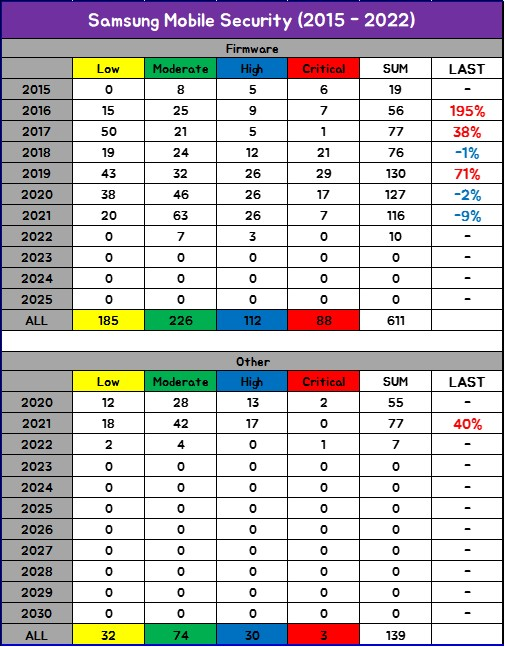

# Android(Samsung) Security Awesome

# Theory
* [Android Kernel Exploitation](https://cloudfuzz.github.io/android-kernel-exploitation/)
* [Hacking Android Apps with Frida](https://www.youtube.com/watch?v=iMNs8YAy6pk)
* [Android_Frida_Scripts](https://github.com/androidmalware/android_frida_scripts)
* [Real-time Kernel Protection (RKP)](https://www.samsungknox.com/ko/blog/real-time-kernel-protection-rkp)
* [Breaking TEE Security](https://www.riscure.com/blog/tee-security-samsung-teegris-part1)
* [Android Developer Fundamentals](https://developer.android.com/courses/fundamentals-training/overview-v2)
* [Android Security Lecture](https://jyheo.github.io/androidsec/androidsec.html) : 허준영 교수님 강의 자료

# Virtual / Build / Source

* [Android Open Source Project (AOSP)](https://source.android.com/setup) : QEMU(Quick Emulator) Hypervisor
* [Android Studio : Android Virtual Device (AVD) Manager](https://developer.android.com/studio)
* [Android x86](https://www.android-x86.org/)
* [Nox Player](https://kr.bignox.com/)
* [Samsung Open Source](https://opensource.samsung.com/main)
* [SamFw](https://samfw.com/) : Android Firmware
* [Frija](https://forum.xda-developers.com/t/tool-frija-samsung-firmware-downloader-checker.3910594/) : Android Firmware

# Fuzzer / Tool

* [Android-afl](https://github.com/ele7enxxh/android-afl)
* [Fuzzing with libFuzzer](https://source.android.com/devices/tech/debug/libfuzzer)
* [Droid: Android application fuzzing framework](https://github.com/ajinabraham/Droid-Application-Fuzz-Framework)
* [Writing the worlds worst Android fuzzer](https://gamozolabs.github.io/fuzzing/2018/10/18/terrible_android_fuzzer.html)
* [DoApp (Denial of App): A smart Android Fuzzer for the future](https://www.iswatlab.eu/security-projects/doapp-denial-of-app-a-smart-android-fuzzer-for-the-future/)
* [Droid-ff](https://github.com/antojoseph/droid-ff)
* [DIFUZER](https://github.com/ucsb-seclab/difuze)
* [Apktool](https://github.com/iBotPeaches/Apktool)
* [JEB Decompiler](https://www.pnfsoftware.com/)
* [Bytecode Viewer](https://bytecodeviewer.com/)
* [RMS-Runtime-Mobile-Security](https://github.com/m0bilesecurity/RMS-Runtime-Mobile-Security)
* [APKLeaks](https://github.com/dwisiswant0/apkleaks)
* [Diffuse](https://github.com/JakeWharton/diffuse) : APK Diff

# Paper / Speaker / Issue

#### 2015
* [Paper] [Fuzzing Android: a recipe for uncovering vulnerabilities inside system components in Android](https://www.blackhat.com/docs/eu-15/materials/eu-15-Blanda-Fuzzing-Android-A-Recipe-For-Uncovering-Vulnerabilities-Inside-System-Components-In-Android-wp.pdf)

#### 2016

* [Paper] [STAB Fuzzing: A Study of Android's Binder IPC and Linux/Android Fuzzing](https://www.semanticscholar.org/paper/STAB-Fuzzing-%3A-A-St-udy-of-A-ndroid-%E2%80%99-s-B-inder-IPC-Peters/9ed41192e02e106b5367c9d143f447f7036b2aa0?p2df)
* [Paper] [안드로이드 장치 드라이버에 대한 효과적 취약점 탐지 기법](http://kiise.or.kr/e_journal/2016/11/JOK/pdf/01.pdf)

#### 2017
* [Speaker] [A Whole New Efficient Fuzzing Strategy for Stagefright](https://slideplayer.com/slide/13546193)

#### 2019
* [Speaker] [KNOX Kernel Mitigation Bypasses](https://powerofcommunity.net/poc2019/x82.pdf)
* ~~[Report] [Samsung Galaxy Apps Store RCE via MITM](https://www.adyta.pt/en/writeup-samsung-app-store-rce-via-mitm-2/)~~ Unable to connect
* [Speaker] [Android Security Internals](https://www.opersys.com/presentations/2019-05-15/android-security-internals-pub/slides-main-190515.html#/)
  * [Video] [Android Security Internals](https://www.youtube.com/watch?v=7QwhF4ANq6Q)

##### 2020
* [Speaker] [Breaking Samsung's Root of Trust - Exploiting Samsung Secure Boot](https://www.blackhat.com/us-20/briefings/schedule/index.html#breaking-samsungs-root-of-trust-exploiting-samsung-s-secure-boot-20290)
* [Report] [Flaws in ‘Find My Mobile’ exposed Samsung phones to hack](https://char49.com/tech-reports/fmmx1-report.pdf)
* [Report] [Project Zero : MMS Exploit](https://googleprojectzero.blogspot.com/2020/07/mms-exploit-part-1-introduction-to-qmage.html)
* [Speaker] [Samsung Security Tech Forum 2020](https://www.youtube.com/watch?v=XDRFY5s1SE8)
* [Speaker] [Qualcomm Compute DSP for Fun and Profit](https://www.youtube.com/watch?v=CrLJ29quZY8)
* [Report] [Breaking Samsung firmware, or turning your S8/S9/S10 into a DIY “Proxmark”](https://www.pentestpartners.com/security-blog/breaking-samsung-firmware-or-turning-your-s8-s9-s10-into-a-diy-proxmark/?fbclid=IwAR0f8lwJmVtXzHU3T7n1zs8CG2QJlSf_3v8ffp03w-rwgb48_QxoUz7D09Q)
	* [Speaker] [Beyond Root](https://www.youtube.com/watch?v=aLe-xW-Ws4c)
* [Report] [Arbitrary code execution on Facebook for Android through download feature](https://dphoeniixx.medium.com/arbitrary-code-execution-on-facebook-for-android-through-download-feature-fb6826e33e0f)
* [Report] [Samsung S20 - RCE via Samsung Galaxy Store App](https://labs.f-secure.com/blog/samsung-s20-rce-via-samsung-galaxy-store-app)

#### 2021
* [Report] [In-the-Wild Series: Android Exploits](https://googleprojectzero.blogspot.com/2021/01/in-wild-series-android-exploits.html)
* ~~[Speaker] [Blowing the Cover of Android Binary Fuzzing](https://speakerdeck.com/flankerhqd/blowing-the-cover-of-android-binary-fuzzing)~~ Unable to connect
	* [Speaker] [3rd Real World CTF: Blowing the cover of android binary fuzzing](https://www.youtube.com/watch?v=y05uja2o6GE)
* [Report] [Data Driven Security Hardening in Android](https://security.googleblog.com/2021/01/data-driven-security-hardening-in.html)
* [Report] [An apparently benign app distribution scheme which has all it takes to turn (very) ugly](https://cryptax.medium.com/an-apparently-benign-app-distribution-scheme-which-has-all-it-takes-to-turn-very-ugly-f733be528535)
* [Issue] [installing third-party apps and providing them Device Admin rights (no permissions required)](https://twitter.com/_bagipro/status/1360982834228432898)
* [Issue] [Vulnerability in Genymotion emulator allows any app to steal and change hosts clipboard](https://github.com/eybisi/misc)
* [Paper] [FraudDetective： 안드로이드 모바일 광고 사기 탐지 및 사기 발생의 인과관계 분석](https://www.ndss-symposium.org/wp-content/uploads/ndss2021_3B-1_23161_paper-1.pdf?fbclid=IwAR2MWn2R-jnO6lhm7z-t2liWiWYgA2UykmTPBeUzSe13Dn5hpSBc_FyM0NQ)
* [Report] [Android Kernel Privilege Escalation (CVE-2020-11239)](https://securitylab.github.com/research/one_day_short_of_a_fullchain_android/)
  * [Exploit] [Exploit for Qualcomm CVE-2020-11239](https://github.com/github/securitylab/tree/main/SecurityExploits/Android/Qualcomm/CVE-2020-11239)
* [Report] [Two weeks of securing Samsung devices](https://blog.oversecured.com/Two-weeks-of-securing-Samsung-devices-Part-1/)
* [Speaker] [Samsung Security Tech Forum 2021](https://www.youtube.com/watch?v=RDl81Jd83zc)
* [Speaker] [Emulating Samsung's Baseband for Security Testing](https://www.youtube.com/watch?v=wkWUU8820ro)
  * [Presentation Slides](https://i.blackhat.com/USA-20/Wednesday/us-20-Hernandez-Emulating-Samsungs-Baseband-For-Security-Testing.pdf)
* [Speaker] [Stealthily Access Your Android Phones: Bypass the Bluetooth Authentication](https://www.youtube.com/watch?v=6J3weqoiads)
  * [Presentation Slides](https://i.blackhat.com/USA-20/Wednesday/us-20-Xu-Stealthily-Access-Your-Android-Phones-Bypass-The-Bluetooth-Authentication.pdf)
* [Speaker] [Over the Air Baseband Exploit: Gaining Remote Code Execution on 5G Smartphones](https://youtu.be/53rIuiQRNg8)
  * [Presentation Slides](https://i.blackhat.com/USA21/Wednesday-Handouts/us-21-Over-The-Air-Baseband-Exploit-Gaining-Remote-Code-Execution-On-5G-Smartphones.pdf)
  * [Paper](https://i.blackhat.com/USA21/Wednesday-Handouts/us-21-Over-The-Air-Baseband-Exploit-Gaining-Remote-Code-Execution-On-5G-Smartphones-wp.pdf)
* [Speaker] [Exploring & Exploiting Zero-Click Remote Interfaces of Modern Huawei Smartphones](https://youtu.be/e9gZEHhBfsM)
  * [Presentation Slides](https://i.blackhat.com/USA21/Wednesday-Handouts/US-21-Komaromy-How-To-Tame-Your-Unicorn.pdf)
  * [Paper](https://i.blackhat.com/USA21/Wednesday-Handouts/US-21-Komaromy-How-To-Tame-Your-Unicorn-wp.pdf)
* [Speaker] [Typhoon Mangkhut: One-click Remote Universal Root Formed with Two Vulnerabilities](https://youtu.be/a1vyt6iWmS4)
  * [Presentation Slides](https://i.blackhat.com/USA21/Wednesday-Handouts/us-21-Typhoon-Mangkhut-One-Click-Remote-Universal-Root-Formed-With-Two-Vulnerabilities.pdf)
* [Speaker] [Breaking Secure Bootloaders](https://youtu.be/XvGcQgx9Jg8)
  * [Presentation Slides](https://i.blackhat.com/USA21/Wednesday-Handouts/us-21-Breaking-Secure-Bootloaders.pdf)
* [Speaker] [Can You Hear Me Now? Remote Eavesdropping Vulnerabilities in Mobile Messaging Applications](https://youtu.be/s44K1IBnw4I)
  * [Presentation Slides](https://i.blackhat.com/USA21/Wednesday-Handouts/us-21-Can-You-Hear-Me-Now-Remote-Eavesdropping-Vulnerabilities-In-Mobile-Messaging-Applications.pdf)

# CVE / SVE
* [Google(Android) CVE DataBase](https://vuldb.com/?vendor.google)
* [Samsung CVE DataBase](https://vuldb.com/?vendor.samsung)
* [Samsung SVE DataBase](https://security.samsungmobile.com/main.smsb)

# NEWS
#### 2020
* [2020.05] [삼성전자, 제로 클릭 취약점 패치 완료](https://blog.alyac.co.kr/2962)
* [2020.08] [‘내 기기 찾기’ 기능에서 취약점 발견, 삼성 모바일 기기 해킹 위험 있어](https://blog.alyac.co.kr/3181)
* [2020.08] [전세계 스마트폰 40%에 내장된 칩 취약점 발견](http://www.inews24.com/view/1291857?fbclid=IwAR2vgkXm7WAiA52MYMvi1iRdt2igehObAvhjX-r-wiajgNtcSorfCdzeNlQ)
* [2020.09] [Code Execution Vulnerability in Instagram App for Android and iOS](https://research.checkpoint.com/2020/instagram_rce-code-execution-vulnerability-in-instagram-app-for-android-and-ios/?fbclid=IwAR11Dco36ih-0_DfFSXdgQ7VReYiWjB22WKQQnTjI4kuxN1CX1KSecFhwy4)

#### 2021
* [2021.03] [구글 안드로이드 오류로 폰 앱 먹통…"웹뷰 삭제하세요"(종합)](https://newsis.com/view/?id=NISX20210323_0001380395)
* [2021.06] [Hackers Can Exploit Samsung Pre-Installed Apps to Spy On Users](https://thehackernews.com/2021/06/hackers-can-exploit-samsung-pre.html)

# etc
##### BugBounty
* [Samsung Mobile Security](https://security.samsungmobile.com/main.smsb)
* [Google Application Security](https://bughunters.google.com/)
* [BugCrowd](https://www.bugcrowd.com/)

#### Blog / Site
* [BlackHat](https://www.blackhat.com/)
* [Awesome-Android-Security #1](https://github.com/saeidshirazi/awesome-android-security)
* [Awesome-Android-Security #2](https://github.com/ashishb/android-security-awesome)
* [SamMobile](https://www.sammobile.com/)
* [XDA Developers](https://forum.xda-developers.com/)
* [ESTsecurity 알약블로그](https://blog.alyac.co.kr/)
* [Cyber Security RSS](https://rss.netking.xyz)

#### SNS
* [Android Infosecurity](https://www.facebook.com/AndroidInfoSec)
* [ExploitWareLabs](https://www.facebook.com/ExWareLabs/)

#### CTF
* [Mobile CTF challenges](https://github.com/xtiankisutsa/awesome-mobile-CTF)

# Samsung Mobile Security Statistics (2022.01.)
